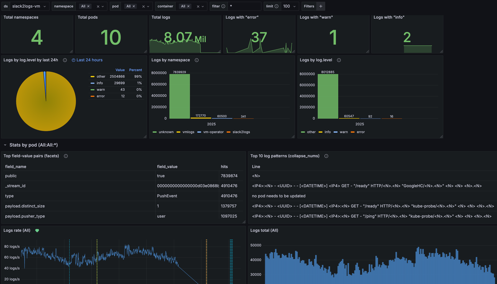

# VictoriaLogs datasource for Grafana

The VictoriaLogs Grafana plugin allows Grafana to query, visualize, 
and interact with [VictoriaLogs](https://docs.victoriametrics.com/victorialogs),
a high-performance log storage and processing system.



## Capabilities

1. Use [LogsQL](https://docs.victoriametrics.com/victorialogs/logsql/) to filter, aggregate, and transform logs data to gain insights into application behavior.
1. Use Explore mode with Grafana.
1. Show live-streaming logs.
1. Build dashboards and setup alerts.
1. Use Ad Hoc filters.

Try it at [VictoriaMetrics playground](https://play-grafana.victoriametrics.com/d/be5zidev72m80f/k8s-logs-demo)!

## Installation

For detailed instructions on how to install the plugin on Grafana Cloud or locally, please checkout the [Plugin installation docs](https://grafana.com/docs/grafana/latest/plugins/installation/).

### Manual configuration via UI

Once the plugin is installed on your Grafana instance, follow [these instructions](https://grafana.com/docs/grafana/latest/datasources/add-a-data-source/)
to add a new VictoriaLogs data source, and enter configuration options.

### Configuration via file

Provisioning of Grafana plugin requires creating [datasource config file](http://docs.grafana.org/administration/provisioning/#datasources):

```yaml
apiVersion: 1
datasources:
    # <string, required> Name of the VictoriaLogs datasource
    # displayed in Grafana panels and queries.
  - name: VictoriaLogs
    # <string, required> Sets the data source type.
    type: victoriametrics-logs-datasource
    # <string, required> Sets the access mode, either
    # proxy or direct (Server or Browser in the UI).
    access: proxy
    # <string> Sets URL for sending queries to VictoriaLogs server.
    # see https://docs.victoriametrics.com/victorialogs/querying/
    url: http://victorialogs:9428
    # <string> Sets the pre-selected datasource for new panels.
    # You can set only one default data source per organization.
    isDefault: true
```

## Building queries

VictoriaLogs query language is [LogsQL](https://docs.victoriametrics.com/victorialogs/logsql/).
Queries can be built using raw LogsQL or via QueryBuilder.

See panels examples at [VictoriaMetrics playground](https://play-grafana.victoriametrics.com/d/be5zidev72m80f/k8s-logs-demo)
and LogsQL examples [here](https://docs.victoriametrics.com/victorialogs/logsql-examples/).


### Logs panel

For using [Logs panel](https://grafana.com/docs/grafana/latest/panels-visualizations/visualizations/logs/)
switch to `Raw Logs` query type:


### Time series panel

For using [Time series panel](https://grafana.com/docs/grafana/latest/panels-visualizations/visualizations/time-series/)
switch to `Range` query type:


### Stats panel

For using [Stats panel](https://grafana.com/docs/grafana/latest/panels-visualizations/visualizations/stat/)
switch to `Instant` query type:


For enabling background visualization switch to `Range` query type.

### Table panel

For using [Table panel](https://grafana.com/docs/grafana/latest/panels-visualizations/visualizations/table/)
switch to `Raw Logs` query type:


And apply `Transformations` by labels:


## License

This project is licensed under
the [Apache 2.0 license](https://github.com/VictoriaMetrics/victorialogs-datasource/blob/main/LICENSE).
